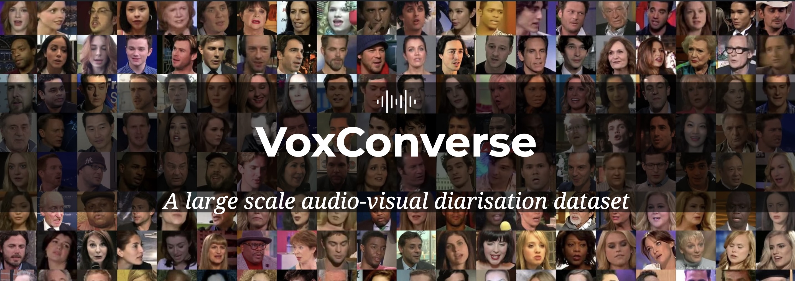
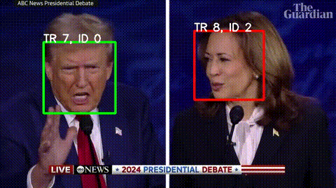
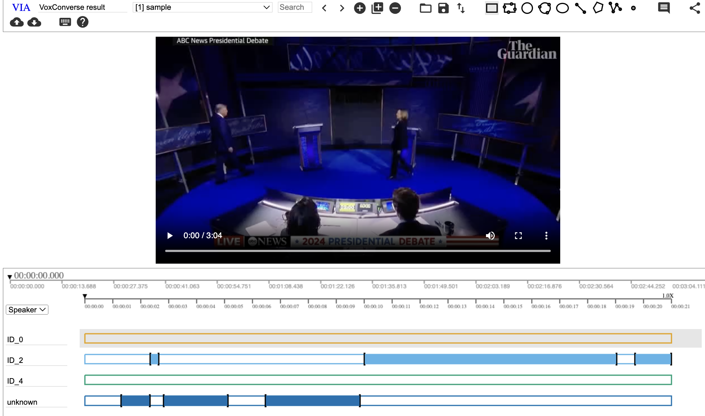
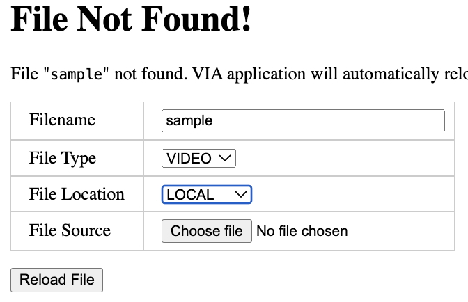

# AV-Diarization
This is a repository to run audio-visual speaker diarization pipeline, which was proposed in the paper "Spot the conversation : speaker diarisation in the wild" (Interspeech 2020).
The pipeline was used to make the VoxConverse dataset.

[[arXiv]](https://arxiv.org/abs/2007.01216) [[VoxConverse]](https://github.com/joonson/voxconverse)



## Installation
1. First, clone the repository.
```shell
git clone https://github.com/JaesungHuh/av-diarization.git
cd av-diarization
```

2. Install packages.
```shell
conda create -n avdiarizer python=3.10 -y
conda activate avdiarizer
pip install --upgrade pip  # enable PEP 660 support
pip install -e .
```

It also requires the command-line tool [ffmpeg](https://ffmpeg.org/) to be installed on your system, which is available from most package managers:
```
# on Ubuntu or Debian
sudo apt update && sudo apt install ffmpeg

# on Arch Linux
sudo pacman -S ffmpeg

# on MacOS using Homebrew (https://brew.sh/)
brew install ffmpeg

# on Windows using Chocolatey (https://chocolatey.org/)
choco install ffmpeg

# on Windows using Scoop (https://scoop.sh/)
scoop install ffmpeg
```

### Upgrade to the latest version
```shell
git pull
pip install -e .
```

## Usage
Please run the following command. The diarization results will be saved in the [PATH OF OUTPUT DIRECTORY].

```shell
python diarize.py -i [PATH OF VIDEOFILE] -o [PATH OF OUTPUT DIRECTORY]
# example : python diarize.py -i sample/sample.mp4 -o output
```

If you want to visualize the face detection / SyncNet results, please put **--visualize** when running the command. The resultant video file will be saved in the output directory.

```shell
python diarize.py -i [PATH OF VIDEOFILE] -o [PATH OF OUTPUT DIRECTORY] --visualize
```



***Argparse arguments***
```
-i, --input (default : sample/sample.mp4): input video file you want to diarize
---cache_dir (default : None): The directory to store intermediate results. If None, the cache will be stored in temporary directory made using tempfile. It will be removed after the process is finished. We advise you to set this to a path where I/O operation is fast.
---ckpt_dir (default : None): The directory to store the model checkpoint. If None, the checkpoints will be downloaded from the internet and stored in ~/.cache/voxconverse.
-o, --out_dir (default : output): The directory to store the output results.
--visualize: If this flag is provided, the face detection and SyncNet results will be visualized and saved in the output directory. Otherwise, no visualization is performed.
--vad (default : pywebrtcvad): Type of voice activity detection model.
--speaker_model (default : resnetse34): Type of speaker recognition model.
```

### Original version
If you want to use the original version that was used to make VoxConverse dataset in 2020, you can use the following command.

```shell
python diarize.py -i [PATH OF VIDEOFILE] -o [PATH OF OUTPUT DIRECTORY] --vad pywebrtcvad --speaker_model resnetse34
```

### New version
The original version was developed in 2020. 
Since then, many new models and libraries have been released. 
We can now use updated [voice activity detection](https://github.com/snakers4/silero-vad) and [speaker recognition](https://huggingface.co/speechbrain/spkrec-ecapa-voxceleb) models.
(Note: SyncNet is trained on cropped faces from S3FD, so we cannot use other face detection or embedding models.)

Run the following command to use the new version.

```shell
python diarize.py -i [PATH OF VIDEOFILE] -o [PATH OF OUTPUT DIRECTORY] --vad silero --speaker_model ecapa-tdnn
```

## Visualize the diarization results
The outputs of this pipeline are a [rttm](https://github.com/nryant/dscore?tab=readme-ov-file#rttm) file and a json file. Json file contains the diarization results that can be visualized using [VIA Video Annotator](https://www.robots.ox.ac.uk/~vgg/software/via/app/via_video_annotator.html).



### Instruction
1. Open the [VIA Video Annotator](https://www.robots.ox.ac.uk/~vgg/software/via/app/via_video_annotator.html)
2. Click **[Open a VIA project]**  at the top of the pane. 

3. Select the json file you want to visualize.
4. You might see this kind of error message below. Click **Choose file** and select the original video (or video with visualization).



## Acknowledgements
Of course, this code is built on top of the previous works.

- **S3FD** : [[paper]](https://arxiv.org/abs/1708.05237) [[code]](https://github.com/cs-giung/face-detection-pytorch)
- **SyncNet** : [[paper]](https://www.robots.ox.ac.uk/~vgg/publications/2016/Chung16a/chung16a.pdf) [[code]](https://github.com/joonson/syncnet_python)
- **Speechbrain project** : [[paper]](https://arxiv.org/abs/2106.04624) [[code]](https://github.com/speechbrain/speechbrain)
- **VoxCeleb_trainer** : [[paper]](https://arxiv.org/abs/2003.11982) [[code]](https://github.com/clovaai/voxceleb_trainer)
- **Silero-vad** : [[code]](https://github.com/snakers4/silero-vad)
- **Pywebrtcvad** : [[code]](https://github.com/wiseman/py-webrtcvad)
- **ECAPA-TDNN** : [[paper]](https://arxiv.org/abs/2005.07143) [[speechbrain-pretrained-model]](https://huggingface.co/speechbrain/spkrec-ecapa-voxceleb)

[This guy](https://scholar.google.co.uk/citations?user=JJ_LQ0YAAAAJ&hl=en) developed the original code.

## Citation

Please cite the following paper if you make use of this code.

```
@article{chung2020spot,
  title={Spot the conversation: speaker diarisation in the wild},
  author={Chung, Joon Son and Huh, Jaesung and Nagrani, Arsha and Afouras, Triantafyllos and Zisserman, Andrew},
  booktitle={Interspeech},
  year={2020}
}
```
